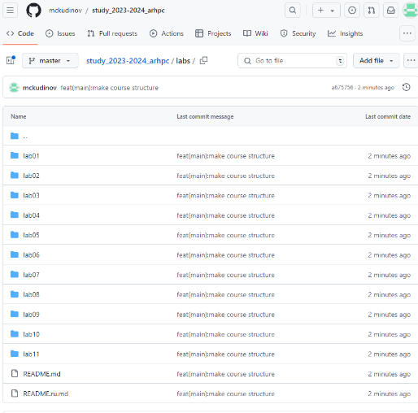

# **РОССИЙСКИЙ УНИВЕРСИТЕТ ДРУЖБЫ НАРОДОВ**
# ` `**Факультет физико-математических и естественных наук Кафедра прикладной информатики и теории вероятностей**
# ` `**ОТЧЕТ**
# ` `**ПО ЛАБОРАТОРНОЙ РАБОТЕ № 2.** дисциплина: Архитектура компьютера 

# Студент: Кудинов М.С.
# ` `Группа: НКАбд-03-24 
#
#
#
#
#
#
#
#
#
#
#
#
# МОСКВА
# 2024 г.

# Содержание
[1	Цель работы	2](#_toc178453044)

[2	Задание	4](#_toc178453045)

[3	Теоретическое введение	5](#_toc178453046)

[4	Выполнение лабораторной работы	6](#_toc178453047)

[4.1	Настройка GitHub	6](#_toc178453048)

[4.2	Базовая настройка Git	7](#_toc178453049)

[4.3	Создание SSH-ключа	8](#_toc178453050)

[4.4	Создание рабочего пространства и репозитория курса на основе шаблона	10](#_toc178453051)

[4.5	Создание репозитория курса на основе шаблона	11](#_toc178453052)

[4.6	Настройка каталога курса	13](#_toc178453053)

[4.7	Выполнение заданий для самостоятельной работы	15](#_toc178453054)

[5	Выводы	16](#_toc178453055)

[6	Список литературы	17](#_toc178453056)

# **1 Цель работы**
Целью данной работы является изучение идеологии и применение средств контроля версий, а также приобретение практических навыков по работе с системой git.

# **2	Задание**
1. Настройка GitHub.
1. Базовая настройка Git.
1. Создание SSH-ключа.
1. Создание рабочего пространства и репозитория курса на основе шаблона.
1. Создание репозитория курса на основе шаблона.
1. Настройка каталога курса.
1. Выполнение заданий для самостоятельной работы.

# **3	Теоретическое введение**
Системы контроля версий (Version Control System, VCS) применяются при работе нескольких человек над одним проектом. Обычно основное дерево проекта хранится в локальном или удалённом репозитории, к которому настроен доступ для участников проекта. При внесении изменений в содержание проекта система контроля версий позволяет их фиксировать, совмещать изменения, произведённые разными участниками проекта, производить откат к любой более ранней версии проекта, если это требуется. В классических системах контроля версий используется централизованная модель, предполагающая наличие единого репозитория для хранения файлов. Выполнение большинства функций по управлению версиями осуществляется специальным сервером. Участник проекта (пользователь) перед началом работы посредством определённых команд получает нужную ему версию файлов. После внесения изменений пользователь размещает новую версию в хранилище. При этом предыдущие версии не удаляются из центрального хранилища и к ним можно вернуться в любой момент. Сервер может сохранять не полную версию изменённых файлов, а производить так называемую дельта-компрессию — сохранять только изменения между последовательными версиями, что позволяет уменьшить объём хранимых данных. Системы контроля версий поддерживают возможность отслеживания и разрешения конфликтов, которые могут возникнуть при работе нескольких человек над одним файлом. Можно объединить изменения, сделанные разными участниками, вручную выбрать нужную версию, отменить изменения вовсе или заблокировать файлы для изменения. В зависимости от настроек блокировка не позволяет другим пользователям получить рабочую копию или препятствует изменению рабочей копии файла средствами файловой системы ОС, обеспечивая таким образом привилегированный доступ только одному пользователю, работающему с файлом. Системы контроля версий также могут обеспечивать дополнительные, более гибкие функциональные возможности. Например, они могут поддерживать работу с несколькими версиями одного файла, сохраняя общую историю изменений до точки ветвления версий и собственные истории изменений каждой ветви. Обычно доступна информация о том, кто из участников, когда и какие изменения вносил. Обычно такого рода информация хранится в журнале изменений, доступ к которому можно ограничить. В отличие от классических, в распределённых системах контроля версий центральный репозиторий не является обязательным. Среди классических VCS наиболее известны CVS, Subversion, а среди распределённых — Git, Bazaar, Mercurial. Принципы их работы схожи, отличаются они в основном синтаксисом используемых в работе команд. Система контроля версий Git представляет собой набор программ командной строки. Доступ к ним можно получить из терминала посредством ввода команды git с различными опциями. Благодаря тому, что Git является распределённой системой контроля версий, резервную копию локального хранилища можно сделать простым копированием или архивацией. Работа пользователя со своей веткой начинается с проверки и получения изменений из центрального репозитория (при этом в локальное дерево до начала этой процедуры не должно было вноситься изменений). Затем можно вносить изменения в локальном дереве и/или ветке. После завершения внесения какого-то изменения в файлы и/или каталоги проекта необходимо разместить их в центральном репозитории.
# **4	Выполнение лабораторной работы**
## **4.1	Настройка GitHub**
Создаю учетную запись на сайте GitHub (рис. 1). Далее я заполнил основные данные учетной записи.

Рис.1

## **4.2	Базовая настройка Git**
Открываю виртуальную машину, затем открываю терминал и делаю предварительную конфигурацию git. (рис. 2).

Рис.2

Задаю имя «master» для начальной ветки (рис. 3).

Задаю параметр autocrlf со значением input, так как я работаю в системе Linux, чтобы конвертировать CRLF в LF только при коммитах (рис. 3). 

Задаю параметр safecrlf со значением warn, так Git будет проверять преобразование на обратимость (рис. 3). При значении warn Git только выведет предупреждение, но будет принимать необратимые конвертации. 

Рис.3

## **4.3	Создание SSH-ключа**
Для последующей идентификации пользователя на сервере репозиториев необходимо сгенерировать пару ключей (приватный и открытый). Для этого ввожу команду ssh-keygen -C “Имя Фамилия, <work@email>”, указывая имя владельца и электронную почту владельца (рис. 4). Ключ автоматически сохранится в каталоге ~/.

Рис. 4

Открываю браузер, захожу на сайт GitHub. Открываю свой профиль и выбираю страницу «SSH and GPG keys». Нажимаю кнопку «New SSH key» (рис. 15).

Рис. 5

## **4.4	Создание рабочего пространства и репозитория курса на основе шаблона**
Закрываю браузер, открываю терминал. Создаю директорию, рабочее пространство, с помощью утилиты mkdir, блягодаря ключу -p создаю все директории после домашней ~/work/study/2022-2023/“Архитектура компьютера” рекурсивно. Далее проверяю с помощью ls, действительно ли были созданы необходимые мне каталоги (рис. 13). Рис. 6

## **4.5	Создание репозитория курса на основе шаблона**
Через терминал перехожу в созданный каталог курса с помощью утилиты cd (рис. 7).

Рис. 7

Клонирую созданный репозиторий с помощью команды git clone –recursive git@github.com:mckudinov/study\_2023–2024\_arh-pc.git arch-pc (рис. 8).

Рис. 8

Копирую ссылку для клонирования на странице созданного репозитория, сначала перейдя в окно «code», далее выбрав в окне вкладку «SSH» (рис. 19).

Рис. 9

## **4.6	Настройка каталога курса**
Перехожу в каталог arch-pc с помощью утилиты cd (рис. 10).

Рис. 10

Удаляю лишние файлы с помощью утилиты rm (рис. 11).

Рис.11

Создаю необходимые каталоги (рис. 12).

Отправляю созданные каталоги с локального репозитория на сервер: добавляю все созданные каталоги с помощью git add, комментирую и сохраняю изменения на сервере как добавление курса с помощью git commit (рис. 12).

Рис. 12

Загружаю все в git(рис. 13).

Рис. 13

Проверяю правильность выполнения работы сначала на самом сайте GitHub (рис.14 ).

Рис. 14

## **4.7	Выполнение заданий для самостоятельной работы**
Копирую лабораторную работу, используя ‘cp’(рис.15).

Рис.15

Захожу в “report” с помощью ‘cd’(рис.16).

Рис. 16

Для отслеживания файлов использую “git add .”, после чего осуществляю перенос с помощью ‘git commit -am’ (рис.17). Остается отправить все в git, используя ‘git push’, но к сожалению мне выдало ошибку¸ которую я так и не смог решить.

Рис. 17

# **5	Выводы**
При выполнении данной лабораторной работы я изучил идеологию и применение средств контроля версий, а также приобрел практические навыки по работе с системой git.

# **6	Список литературы**
1. [Архитектура ЭВМ](https://esystem.rudn.ru/pluginfile.php/1584622/mod_resource/content/1/%D0%9B%D0%B0%D0%B1%D0%BE%D1%80%D0%B0%D1%82%D0%BE%D1%80%D0%BD%D0%B0%D1%8F%20%D1%80%D0%B0%D0%B1%D0%BE%D1%82%D0%B0%20%E2%84%963.pdf)
1. [Git - gitattributes Документация](https://git-scm.com/docs/gitattributes)
