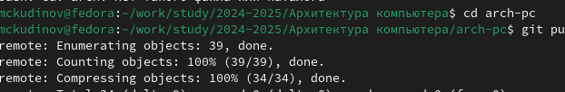
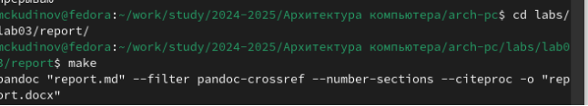
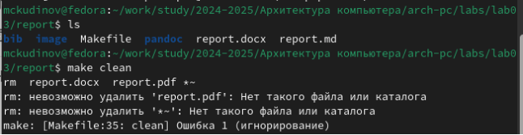
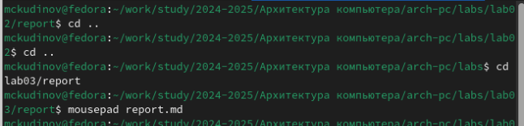
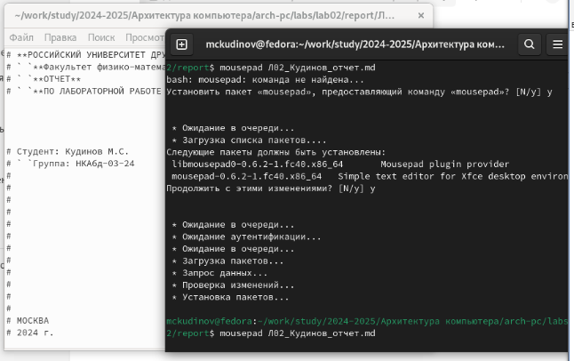

Отчёт по лабораторной работе №3

Дисциплина: Архитектура компьютера

Кудинов Максим Сергеевич

НКАбд-03-24

Москва, 2024 г.
# Содержание
[1	Цель работы	3](#_toc179633565)

[2	Задание	3](#_toc179633566)

[3	Теоретическое введение	3](#_toc179633567)

[4	Выполнение лабораторной работы	3](#_toc179633568)

[4.1	Компиляция шаблонов отчета	3](#_toc179633569)

[4.2	Задания для самостоятельной работы	4](#_toc179633570)

[5	Выводы	6](#_toc179633571)

[6	Список литературы	7](#_toc179633572)

#

# 1	Цель работы
Целью данной лабораторной работы является освоение процедуры оформления отчетов с помощью легковесного языка разметки Markdown.
# 2	Задание
- Установка необходимого ПО
- Заполнение отчета по выполнению лабораторной работы №3 с помощью языка разметки Markdown
- Задание для самостоятельной работы
# 3	Теоретическое введение
Markdown — облегчённый язык разметки, созданный с целью обозначения форматирования в простом тексте, с максимальным сохранением его читаемости человеком, и пригодный для машинного преобразования в языки для продвинутых публикаций (HTML, Rich Text и других).
# 4	Выполнение лабораторной работы
## 4.1	Компиляция шаблонов отчета
В терминале перехожу в директорию курса, обновляю репозиторий с удаленного на GitHub. (рис. 1)

*Рис. 1: Обновление изменений в директории курса*

Провожу компиляцию шаблона с помощью команды make (рис. 2), проверяю корректность исполнения команды с помощью команды ls (рис. 3)

*Рис. 2: Компиляция шаблона*

После проверки работоспособности компилятора шаблонов, я удаляю сгенерированные файлы с помощью команды make clean (рис. 3)

*Рис. 3: Проверка и удаление*

После проверки работоспособности компилятора шаблонов, я удаляю сгенерированные файлы с помощью команды make clean (рис. 3)

С помощью редактора выполняю отчет по выполненной лабораторной работе (рис. 5)

*Рис. 4: Подготовка отчёта*
## 4.2	Задания для самостоятельной работы
Аналогично выполнению отчета по текующей лабораторной работе, я выполняю отчет в markdown и по второй лабораторной работе, для этого перехожу в директорию 2 лабораторной работы и готовлю отчет с помощью текстового редактора mousepad. (рис. 5)

*Рис. 5: Выполнение отчета по 2 лабораторной работе*

# 5	Выводы
В результате выполнения данной лабораторной работы я освоила процедуры оформления отчетов с помощью легковесного языка разметки Markdown.

# 6	Список литературы
Архитектура ЭВМ
