**Отчёта по лабораторной работе №4** 

**Дисциплина: архитектура компьютера** 
Кудинов Максим Сергеевич НКАбд-03-24 

Содержание 

[1  Цель работы ........................................................................................................................................................ 2 ](#_page1_x82.00_y307.00)[2  Задание .................................................................................................................................................................. 2 ](#_page1_x325.00_y692.00)[3  Теоретическое введение............................................................................................................................... 3 ](#_page2_x82.00_y137.00)[4  Выполнение лабораторной работы........................................................................................................ 4 ](#_page3_x82.00_y323.00)

1. [Создание программы Hello world! ................................................................................................... 4 ](#_page3_x82.00_y358.00)
1. [Работа с транслятором NASM ............................................................................................................ 5 ](#_page4_x82.00_y598.00)
1. [Работа с расширенным синтаксисом командной строки NASM ..................................... 6 ](#_page5_x82.00_y182.00)
1. [Работа с компоновщиком LD ............................................................................................................. 6 ](#_page5_x82.00_y406.00)
1. [Запуск исполняемого файла .............................................................................................................. 7 ](#_page6_x82.00_y57.00)
1. [Выполнение заданий для самостоятельной работы. ........................................................... 7 ](#_page6_x82.00_y196.00)

[5  Выводы ............................................................................................................................................................... 10 ](#_page9_x82.00_y281.00)[6  Список литературы ...................................................................................................................................... 10 ](#_page9_x82.00_y364.00)

**1  Цель работы** 

Цель данной лабораторной работы - освоить процедуры компиляции и сборки программ, написанных на ассемблере NASM.2 Задание 

1. Создание программы Hello world! 
2. Работа с транслятором NASM 
2. Работа с расширенным синтаксисом командной строки NASM 
2. Работа с компоновщиком LD 
2. Запуск исполняемого файла 
2. Выполнение заданий для самостоятельной работы. 

**3  Теоретическое введение** 

Основными функциональными элементами любой ЭВМ являются центральный процессор, память и периферийные устройства. Взаимодействие этих устройств осуществляется через общую шину, к которой они подключены. Физически шина представляет собой большое количество проводников, соединяющих устройства друг с другом. В современных компьютерах проводники выполнены в виде электропроводящих дорожек на материнской плате. Основной задачей процессора является обработка информации, а также организация координации всех узлов компьютера. В состав центрального процессора входят следующие устройства: - арифметико-логическое устройство (АЛУ) — выполняет логические и арифметические действия, необходимые для обработки информации, хранящейся в памяти; - устройство управления (УУ) — обеспечивает управление и контроль всех устройств компьютера; - регистры — сверхбыстрая оперативная память небольшого объёма, входящая в состав процессора, для временного хранения промежуточных результатов выполнения инструкций; регистры процессора делятся на два типа: регистры общего назначения и специальные регистры. Для того, чтобы писать программы на ассемблере, необходимо знать, какие регистры процессора существуют и как их можно использовать. Большинство команд в программах написанных на ассемблере используют регистры в каче- стве операндов. Практически все команды представляют собой преобразование данных хранящихся в регистрах процессора, это например пересылка данных между регистрами или между регистрами и памятью, преобразование (арифметические или логические операции) данных хранящихся в регистрах. Доступ к регистрам осуществляется не по адресам, как к основной памяти, а по именам. Каждый регистр процессора архитектуры x86 имеет свое название, состоящее из 2 или 3 букв латинского алфавита. В качестве примера приведем названия основных регистров общего назначения (именно эти регистры чаще всего используются при написании программ): - RAX, RCX, RDX, RBX, RSI, RDI — 64-битные - EAX, ECX, EDX, EBX, ESI, EDI — 32-битные - AX, CX, DX, BX, SI, DI — 16-битные - AH, AL, CH, CL, DH, DL, BH, BL — 8-битные 

Другим важным узлом ЭВМ является оперативное запоминающее устройство (ОЗУ). ОЗУ — это быстродействующее энергозависимое запоминающее устройство, которое напрямую взаимодействует с узлами процессора, предназначенное для хранения программ и данных, с которыми процессор непосредственно работает в текущий момент. ОЗУ состоит из одинаковых пронумерованных ячеек памяти. Номер ячейки памяти — это адрес хранящихся в ней данных. Периферийные устройства в составе ЭВМ: - устройства внешней памяти, которые предназначены для долговременного хранения больших объёмов данных. - устройства ввода-вывода, которые обеспечивают взаимодействие ЦП с внешней средой. 

В основе вычислительного процесса ЭВМ лежит принцип программного управления. Это означает, что компьютер решает поставленную задачу как последовательность действий, записанных в виде программы. 

Коды команд представляют собой многоразрядные двоичные комбинации из 0 и 1. В коде машинной команды можно выделить две части: операционную и адресную. В операционной части хранится код команды, которую необходимо выполнить. В адресной части хранятся данные или адреса данных, которые участвуют в выполнении данной операции. При выполнении каждой команды процессор выполняет определённую последовательность стандартных действий, которая называется командным циклом процессора. Он заключается в следующем: 1. формирование адреса в памяти очередной команды; 2. считывание кода команды из памяти и её дешифрация; 3. выполнение команды; 4. переход к следующей команде. 

Язык ассемблера (assembly language, сокращённо asm) — машинно-ориентированный язык низкого уровня. NASM — это открытый проект ассемблера, версии которого доступны под различные операционные системы и который позволяет получать объектные файлы для этих систем. В NASM используется Intel-синтаксис и поддерживаются инструкции x86-64. 

**4  Выполнение лабораторной работы** 

1. **Создание программы Hello world!** 

С помощью утилиты cd перемещаюсь в каталог, в котором буду работать (рис. 1). 

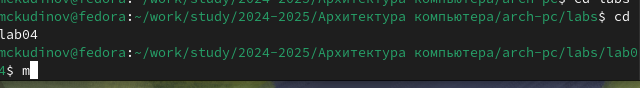

*Рис. 1: Перемещение между директориями* 

Создаю в текущем каталоге пустой текстовый файл hello.asm с помощью утилиты touch (рис. 2). 

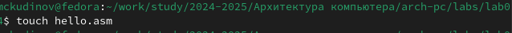

*Рис. 2: Создание пустого файла* 

Открываю созданный файл в текстовом редакторе mousepad (рис. 3). 

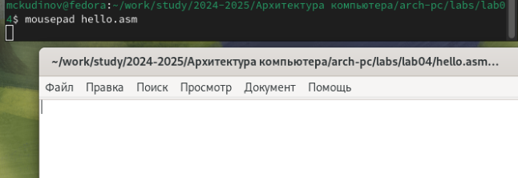

*Рис. 3: Открытие файла в текстовом редакторе* 

Заполняю файл, вставляя в него программу для вывода “Hello word!” (рис. 4). 

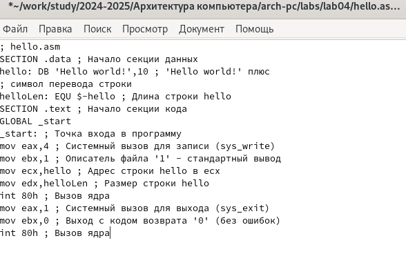

*Рис. 4: Заполнение файла* 

2. **Работа с транслятором NASM** 

Превращаю текст программы для вывода “Hello world!” в объектный код с помощью транслятора NASM, используя команду nasm -f elf hello.asm, ключ -f указывает транслятору nasm, что требуется создать бинарный файл в формате ELF (рис. 5). Далее проверяю правильность выполнения команды с помощью утилиты ls: действительно, создан файл “hello.o”. 

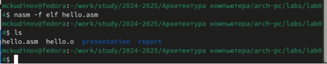

*Рис. 5: Компиляция текста программы* 

3. **Работа с расширенным синтаксисом командной строки NASM** 

Ввожу команду, которая скомпилирует файл hello.asm в файл obj.o, при этом в файл будут включены символы для отладки (ключ -g), также с помощью ключа -l будет создан файл листинга list.lst (рис. 6). Далее проверяю с помощью утилиты ls правильность выполнения команды. 

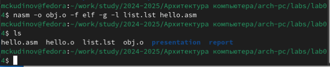

*Рис. 6: Компиляция текста программы* 

4. **Работа с компоновщиком LD** 

Передаю объектный файл hello.o на обработку компоновщику LD, чтобы получить исполняемый файл hello (рис. 7). Ключ -о задает имя создаваемого исполняемого файла. Далее проверяю с помощью утилиты ls правильность выполнения команды. 

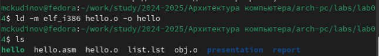

*Рис. 7: Передача объектного файла на обработку компоновщику* 

Выполняю следующую команду (рис. 8). Исполняемый файл будет иметь имя main, т.к. после ключа -о было задано значение main. Объектный файл, из которого собран этот исполняемый файл, имеет имя obj.o 

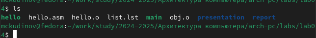

*Рис. 8: Передача объектного файла на обработку компоновщику* 

5. **Запуск исполняемого файла** 

Запускаю на выполнение созданный исполняемый файл hello (рис. 9). 

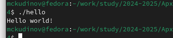

*Рис. 9: Запуск исполняемого файла* 

6. **Выполнение заданий для самостоятельной работы.** 

С помощью утилиты cp создаю в текущем каталоге копию файла hello.asm с именем lab4.asm (рис. 10). 

*Рис. 10: Создание копии файла* 

С помощью текстового редактора mousepad открываю файл lab4.asm и вношу изменения в программу так, чтобы она выводила мои имя и фамилию. (рис. 11). 

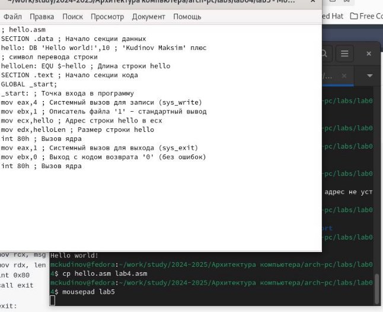

*Рис. 11: Изменение программы* 

Компилирую текст программы в объектный файл (рис. 12). Проверяю с помощью утилиты ls, что файл lab4.o создан. 

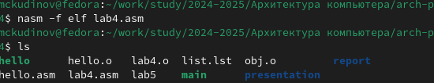

*Рис. 12: Компиляция текста программы* 

Передаю объектный файл lab4.o на обработку компоновщику LD, чтобы получить исполняемый файл lab4 (рис. 13). 

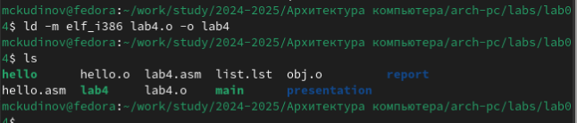

*Рис. 13: Передача объектного файла на обработку компоновщику* 

Запускаю исполняемый файл lab4, на экран действительно выводятся мои имя и фамилия (рис. 14). 

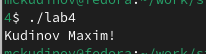

*Рис. 14* 

Удаляю лишние файлы в текущем каталоге с помощью утилиты rm, ведь копии файлов остались в другой директории (рис. 15). 

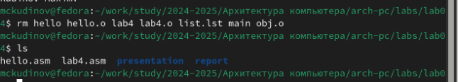

*Рис. 15: Удаление лишних файлов в текущем каталоге* 

С помощью команд git add . и git commit добавляю файлы на GitHub, комментируя действие как добавление файлов для лабораторной работы №4 (рис. 16). 

*Рис. 16: Добавление файлов на GitHub* 

Отправляю файлы на сервер с помощью команды git push (рис. 17). 

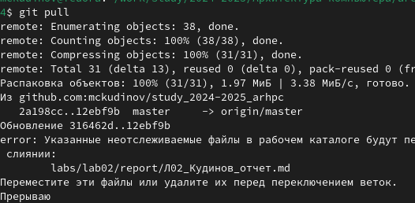

*Рис. 17: Отправка файлов* 

**5  Выводы** 

При выполнении данной лабораторной работы я освоил процедуры компиляции и сборки программ, написанных на ассемблере NASM. 

**6  Список литературы** 

1\.  https://esystem.rudn.ru/pluginfile.php/1584628/mod\_resource/content/1/%D0%9B

%D0%B0%D0%B1%D0%BE%D1%80%D0%B0%D1%82%D0%BE%D1%80%D0%B D%D0%B0%D1%8F%20%D1%80%D0%B0%D0%B1%D0%BE%D1%82%D0%B0%2 0%E2%84%965.pdf 
