**Отчет по лабораторной работе №6** 

**Дисциплина: архитектура компьютера** 

Кудинов Максим Сергеевич НКАбд-03-24 

Содержание 

[1  Цель работы ........................................................................................................................................................ 3 ](#_page2_x82.00_y57.00)[2  Задание .................................................................................................................................................................. 3 ](#_page2_x82.00_y123.00)[3  Теоретическое введение............................................................................................................................... 3 ](#_page2_x82.00_y223.00)[4  Выполнение лабораторной работы........................................................................................................ 4 ](#_page3_x82.00_y57.00)

1. [Основы работы с mc ............................................................................................................................... 4 ](#_page3_x82.00_y77.00)
1. [Структура программы на языке ассемблера NASM ............................................................... 7 ](#_page6_x82.00_y57.00)
1. [Подключение внешнего файла......................................................................................................... 9 ](#_page8_x82.00_y57.00)
1. [Выполнение заданий для самостоятельной работы ......................................................... 11 ](#_page10_x82.00_y57.00)

[5  Выводы ............................................................................................................................................................... 15 ](#_page14_x82.00_y57.00)[6  Список литературы ...................................................................................................................................... 16 ](#_page15_x82.00_y57.00)

**1  Цель работы** 

Целью данной лабораторной работы является приобретение практических навыков работы в Midnight Commander, освоение инструкций языка ассемблера mov и int. 

**2  Задание** 

1. Основы работы с mc 
1. Структура программы на языке ассемблера NASM 
1. Подключение внешнего файла 
1. Выполнение заданий для самостоятельной работы 

**3  Теоретическое введение** 

Midnight Commander (или просто mc) — это программа, которая позволяет просматривать структуру каталогов и выполнять основные операции по управлению файловой системой, т.е. mc является файловым менеджером. Midnight Commander позволяет сделать работу с файлами более удобной и наглядной. Программа на языке ассемблера NASM, как правило, состоит из трёх секций: секция кода программы (SECTION .text), секция инициированных (известных во время компиляции) данных (SECTION .data) и секция неинициализированных данных (тех, под которые во время компиляции только отводится память, а значение присваивается в ходе выполнения программы) (SECTION .bss). Для объявления инициированных данных в секции .data используются директивы DB, DW, DD, DQ и DT, которые резервируют память и указывают, какие значения должны храниться в этой памяти: - DB (define byte) — определяет переменную размером в 1 байт; - DW (define word) — определяет переменную размеров в 2 байта (слово); - DD (define double word) — определяет переменную размером в 4 байта (двойное слово); - DQ (define quad word) — определяет переменную размером в 8 байт (учетве- рённое слово); - DT (define ten bytes) — определяет переменную размером в 10 байт. Директивы используются для объявления простых переменных и для объявления массивов. Для определения строк принято использовать директиву DB в связи с особенностями хранения данных в оперативной памяти. Инструкция языка ассемблера mov предназначена для дублирования данных источника в приёмнике. 

**mov** dst,src

Здесь операнд dst — приёмник, а src — источник. В качестве операнда могут выступать регистры (register), ячейки памяти (memory) и непосредственные значения (const). Инструкция языка ассемблера intпредназначена для вызова прерывания с указанным номером. 

**int** n

Здесь n — номер прерывания, принадлежащий диапазону 0–255. При программировании в Linux с использованием вызовов ядра sys\_calls n=80h (принято задавать в шестнадцатеричной системе счисления). 

**4  Выполнение лабораторной работы** 

1. **Основы работы с mc** 

Открываю Midnight Commander, введя в терминал mc (рис. 1). 

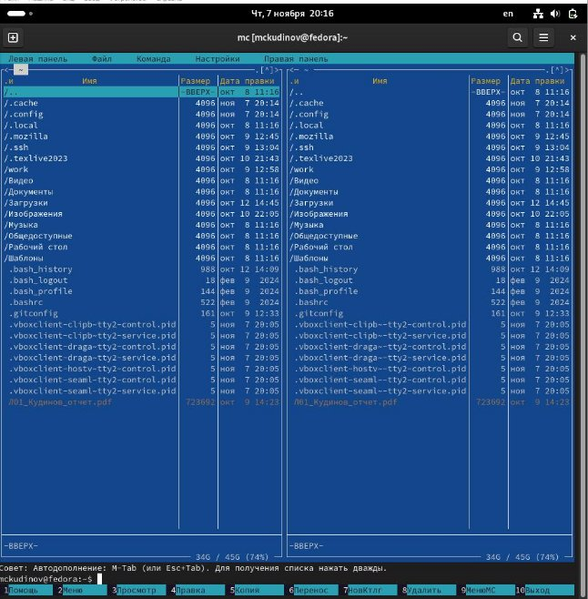

*Рис. 1: Открытый mc* 

Перехожу в каталог ~/work/study/2024-2025/Архитектура Компьютера/arch-pc, используя файловый менеджер mc (рис. 2) 

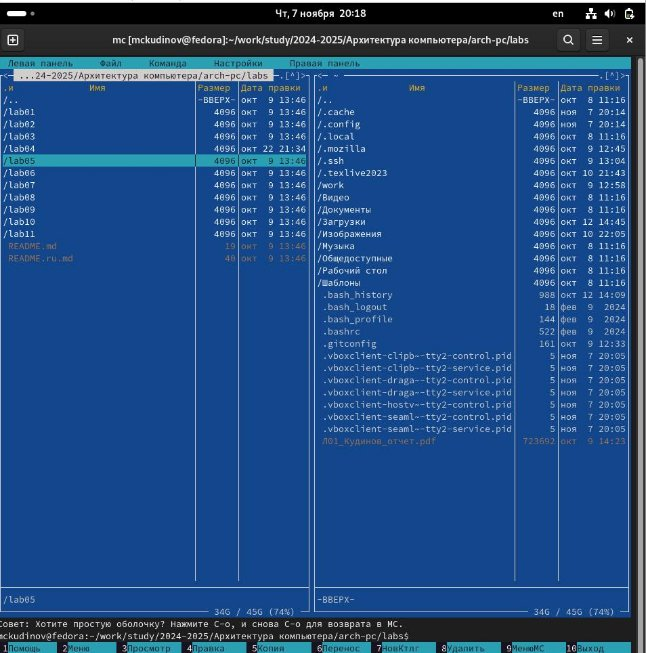

*Рис. 2: Перемещение между директориям* 

С помощью функциональной клавиши F7 создаю каталог lab05 (рис. 3). 

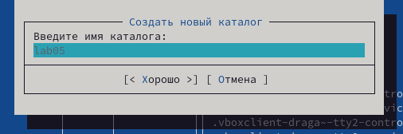

*Рис. 3: Создание каталога* 

Переходу в созданный каталог (рис. 4). 

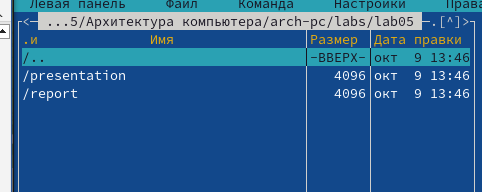

*Рис. 4: Перемещение между директориями* 

В строке ввода прописываю команду touch lab05.asm, чтобы создать файл, в котором буду работать (рис. 5). 

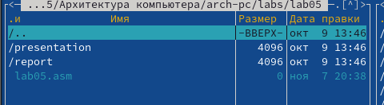

*Рис. 5: Создание файла* 

2. **Структура программы на языке ассемблера NASM** 

С помощью функциональной клавиши F4 открываю созданный файл для редактирования в редакторе nano (рис. 6). 

*Рис. 6: Открытие файла для редактирования* 

Ввожу в файл код программы для запроса строки у пользователя (рис. 7). Далее выхожу из файла (Ctrl+X), сохраняя изменения (Y, Enter). 

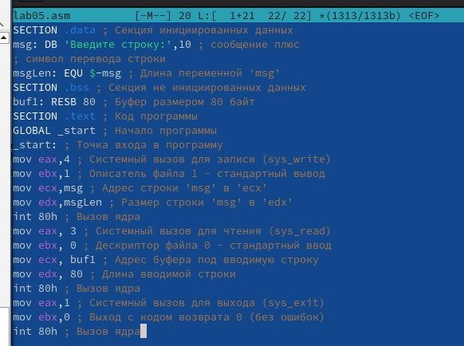

*Рис. 7: Редактирование файла* 

С помощью функциональной клавиши F3 открываю файл для просмотра, чтобы проверить, содержит ли файл текст программы (рис. 8). 

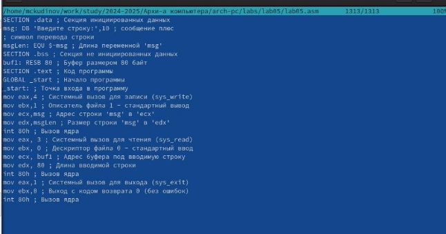

*Рис. 8: Открытие файла для просмотра* 

Транслирую текст программы файла в объектный файл командой nasm -f elf lab05.asm. Создался объектный файл lab05.o. Выполняю компоновку объектного файла с помощью команды ld -m elf\_i386 -o lab05 lab05.o (рис. 9). Создался исполняемый файл lab05. 

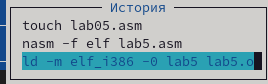

*Рис. 9: Компиляция файла и передача на обработку компоновщику* 

Запускаю исполняемый файл. Программа выводит строку “Введите строку:” и ждет ввода с клавиатуры, я ввожу свои ФИО, на этом программа заканчивает свою работу (рис. 10). 

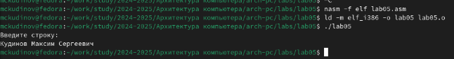

*Рис. 10: Исполнение файла* 

3. **Подключение внешнего файла** 

Скачиваю файл in\_out.asm со страницы курса в ТУИС. Он сохранился в каталог “Загрузки” (рис. 11). 

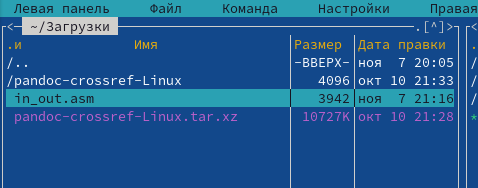

*Рис. 11: Скачанный файл* 

С помощью функциональной клавиши F5 копирую файл in\_out.asm из каталога Загрузки в созданный каталог lab05 (рис. 12). 

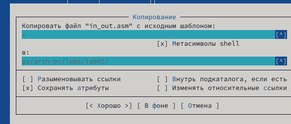

*Рис. 12: Копирование файла* 

С помощью функциональной клавиши F5 копирую файл lab05 в тот же каталог, но с другим именем, для этого в появившемся окне mc прописываю имя для копии файла (рис. 13). 

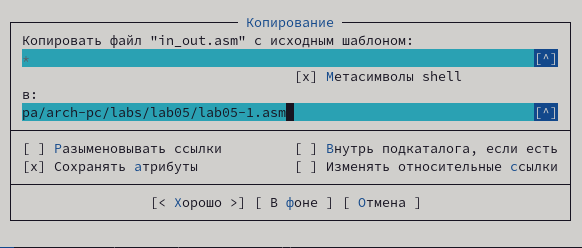

*Рис. 13: Копирование файла* 

Изменяю содержимое файла lab05-1.asm во встроенном редакторе nano (рис. 14), чтобы в программе использовались подпрограммы из внешнего файла in\_out.asm. 

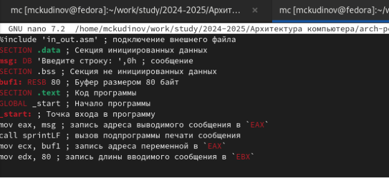

*Рис. 14: Редактирование файла* 

Транслирую текст программы файла в объектный файл командой nasm -f elf lab05- 1.asm. Создался объектный файл lab6-2.o. Выполняю компоновку объектного файла с помощью команды ld -m elf\_i386 -o lab05-1 lab05-1.o Создался исполняемый файл lab05- 1. Запускаю исполняемый файл (рис. 15). 

*Рис. 15: Исполнение файла* 

4. **Выполнение заданий для самостоятельной работы** 
1. Создаю копию файла lab05.asm с именем lab05-1-1.asm с помощью функциональной клавиши F5 (рис. 18). 

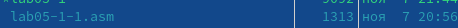

*Рис. 16: Копирование файла* 

С помощью функциональной клавиши F4 открываю созданный файл для редактирования. Изменяю программу так, чтобы кроме вывода приглашения и запроса ввода, она выводила вводимую пользователем строку (рис. 19). 

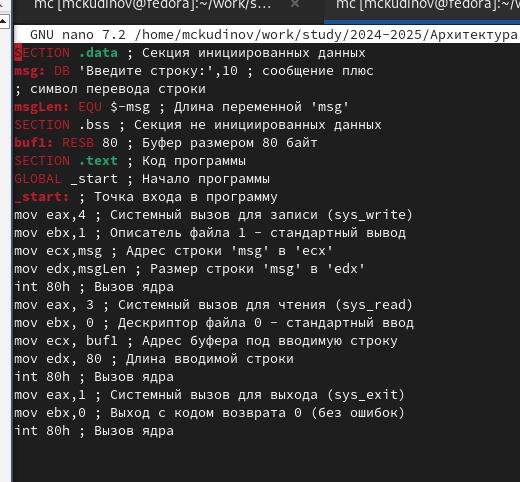

*Рис. 17: Редактирование файла* 

2. Создаю объектный файл lab05-1-1.o, отдаю его на обработку компоновщику, получаю исполняемый файл lab05-1-1, запускаю полученный исполняемый файл. Программа запрашивает ввод, ввожу свои ФИО, далее программа выводит введенные мною данные (рис. 20). 

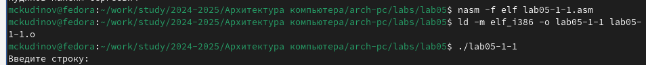

*Рис. 18: Исполнение файла* 

Код программы из пункта 1: 

**SECTION** .data *; Секция инициированных данных*

msg: DB 'Введите строку:',10

msgLen: EQU $-msg *; Длина переменной 'msg'*

**SECTION** .bss *; Секция не инициированных данных* buf1: RESB 80 *; Буфер размером 80 байт*

**SECTION** .text *; Код программы*

**GLOBAL** \_start *; Начало программы*

\_start: *; Точка входа в программу*

**mov** **eax**,4 *; Системный вызов для записи (sys\_write)* **mov** **ebx**,1 *; Описатель файла 1 - стандартный вывод* **mov** **ecx**,msg *; Адрес строки 'msg' в 'ecx'*

**mov** **edx**,msgLen *; Размер строки 'msg' в 'edx'*

**int** 80h *; Вызов ядра*

**mov** **eax**, 3 *; Системный вызов для чтения (sys\_read)* **mov** **ebx**, 0 *; Дескриптор файла 0 - стандартный ввод* **mov** **ecx**, buf1 *; Адрес буфера под вводимую строку* **mov** **edx**, 80 *; Длина вводимой строки*

**int** 80h *; Вызов ядра*

**mov** **eax**,4 *; Системный вызов для записи (sys\_write)* **mov** **ebx**,1 *; Описатель файла '1' - стандартный вывод* **mov** **ecx**,buf1 *; Адрес строки buf1 в ecx*

**mov** **edx**,buf1 *; Размер строки buf1*

**int** 80h *; Вызов ядра*

**mov** **eax**,1 *; Системный вызов для выхода (sys\_exit)* **mov** **ebx**,0 *; Выход с кодом возврата 0 (без ошибок)* **int** 80h *; Вызов ядра*

3. Создаю копию файла lab05-1-1.asm с именем lab05-1-1-1.asm с помощью функциональной клавиши F5 (рис. 21). 

*Рис. 19: Копирование файла* 

С помощью функциональной клавиши F4 открываю созданный файл для редактирования. Изменяю программу так, чтобы кроме вывода приглашения и запроса ввода, она выводила вводимую пользователем строку (рис. 22). 

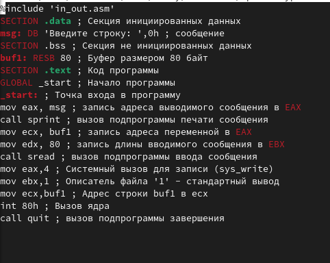

*Рис. 20: Редактирование файла* 

4. Создаю объектный файл lab05-1-1-1.o, отдаю его на обработку компоновщику, получаю исполняемый файл lab05-1-1-1, запускаю полученный исполняемый файл. Программа запрашивает ввод без переноса на новую строку, ввожу свои ФИО, далее программа выводит введенные мною данные (рис. 23). 

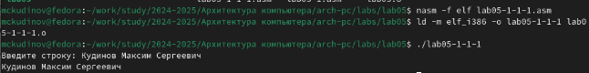

*Рис. 21: Исполнение файла* Код программы из пункта 3: 

%include 'in\_out.asm'

**SECTION** .data *; Секция инициированных данных*

msg: DB 'Введите строку: ',0h *; сообщение*

**SECTION** .bss *; Секция не инициированных данных*

buf1: RESB 80 *; Буфер размером 80 байт*

**SECTION** .text *; Код программы*

**GLOBAL** \_start *; Начало программы*

\_start: *; Точка входа в программу*

**mov** **eax**, msg *; запись адреса выводимого сообщения в `EAX`* **call** sprint *; вызов подпрограммы печати сообщения*

**mov** **ecx**, buf1 *; запись адреса переменной в `EAX`*

**mov** **edx**, 80 *; запись длины вводимого сообщения в `EBX`* **call** sread *; вызов подпрограммы ввода сообщения*

**mov** **eax**,4 *; Системный вызов для записи (sys\_write)* **mov** **ebx**,1 *; Описатель файла '1' - стандартный вывод* **mov** **ecx**,buf1 *; Адрес строки buf1 в ecx*

**int** 80h *; Вызов ядра*

**call** quit *; вызов подпрограммы завершения* 

**5  Выводы** 

При выполнении данной лабораторной работы я получил практические навыки работы в Midnight Commander, а также практиковал инструкции языка ассемблера mov и int. 

**6  Список литературы** 

1\.  [Лабораторная работа №5 ](https://esystem.rudn.ru/pluginfile.php/1584633/mod_resource/content/1/%D0%9B%D0%B0%D0%B1%D0%BE%D1%80%D0%B0%D1%82%D0%BE%D1%80%D0%BD%D0%B0%D1%8F%20%D1%80%D0%B0%D0%B1%D0%BE%D1%82%D0%B0%20%E2%84%966.pdf)
