**Отчет по лабораторной работе №6** 

**Дисциплина: архитектура компьютера** 

Кудинов Максим Сергеевич 

Содержание 

[1  Цель работы ........................................................................................................................................................ 1 ](#_page0_x82.00_y383.00)[2  Задание .................................................................................................................................................................. 2 ](#_page1_x82.00_y123.00)[3  Теоретическое введение............................................................................................................................... 2 ](#_page1_x82.00_y207.00)[4  Выполнение лабораторной работы........................................................................................................ 3 ](#_page2_x82.00_y57.00)

1. [Символьные и численные данные в NASM ................................................................................ 3 ](#_page2_x82.00_y77.00)
1. [Выполнение арифметических операций в NASM ................................................................... 8 ](#_page7_x82.00_y57.00)

[4.2.1  Ответы на вопросы по программе ...................................................................................... 11 ](#_page10_x82.00_y696.00)

3. [Выполнение заданий для самостоятельной работы ......................................................... 13 ](#_page11_x161.00_y396.00)[5  Выводы............................................................................................................................................................... 16 ](#_page14_x330.00_y70.00)[6  Список литературы...................................................................................................................................... 17 ](#_page16_x82.00_y57.00)

   **1  Цель работы** 

   Цель данной лабораторной работы - освоение арифметческих инструкций языка ассемблера NASM. 

   **2  Задание** 

1. Символьные и численные данные в NASM 
1. Выполнение арифметических операций в NASM 
1. Выполнение заданий для самостоятельной работы 

**3  Теоретическое введение** 

Большинство инструкций на языке ассемблера требуют обработки операндов. Адрес операнда предоставляет место, где хранятся данные, подлежащие обработке. Это могут быть данные хранящиеся в регистре или в ячейке памяти. - Регистровая адресация – операнды хранятся в регистрах и в команде используются имена этих регистров, например: mov ax,bx. - Непосредственная адресация – значение операнда задается непосредственно в команде, Например: mov ax,2. - Адресация памяти – операнд задает адрес в памяти. В команде указывается символическое обозначение ячейки памяти, над содержимым которой требуется выполнить операцию. 

Ввод информации с клавиатуры и вывод её на экран осуществляется в символьном виде. Кодирование этой информации производится согласно кодовой таблице символов ASCII. ASCII – сокращение от American Standard Code for Information Interchange (Американский стандартный код для обмена информацией). Согласно стандарту ASCII каждый символ кодируется одним байтом. Среди инструкций NASM нет такой, которая выводит числа (не в символьном виде). Поэтому, например, чтобы вывести число, надо предварительно преобразовать его цифры в ASCII-коды этих цифр и выводить на экран эти коды, а не само число. Если же выводить число на экран непосредственно, то экран воспримет его не как число, а как последовательность ASCII- символов – каждый байт числа будет воспринят как один ASCII-символ – и выведет на экран эти символы. Аналогичная ситуация происходит и при вводе данных с клавиатуры. Введенные данные будут представлять собой символы, что сделает невозможным получение корректного результата при выполнении над ними арифметических операций. Для решения этой проблемы необходимо проводить преобразование ASCII символов в числа и обратно 

**4  Выполнение лабораторной работы** 

1. **Символьные и численные данные в NASM** 

Перехожу в созданный каталог с помощью утилиты cd. 

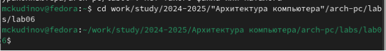

*Рис. 1: Переход* 

С помощью утилиты touch создаю файл lab6-1.asm (рис. 2). 

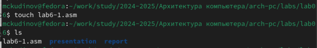

*Рис. 2: Создание файла* 

Копирую в текущий каталог файл in\_out.asm с помощью утилиты cp, т.к. он будет использоваться в других программах (рис. 3). 

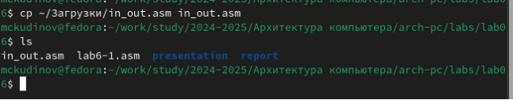

*Рис. 3: Создание копии файла* 

Открываю созданный файл lab6-1.asm, вставляю в него программу вывода значения регистра eax (рис. 4). 

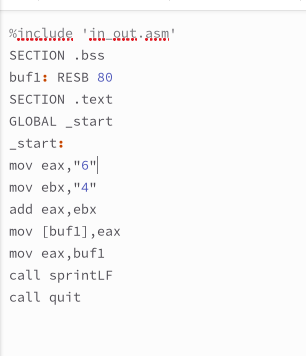

*Рис. 4: Редактирование файла* 

Создаю исполняемый файл программы и запускаю его (рис. 5). Вывод программы: символ j, потому что программа вывела символ, соответствующий по системе ASCII сумме двоичных кодов символов 4 и 6. 

*Рис. 5: Запуск исполняемого файла* 

Изменяю в тексте программы символы “6” и “4” на цифры 6 и 4 (рис. 6). 

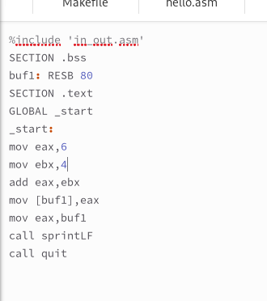

*Рис. 6: Редактирование файла* 

Создаю новый исполняемый файл программы и запускаю его (рис. 7). Теперь вывелся символ с кодом 10, это символ перевода строки, этот символ не отображается при выводе на экран. 

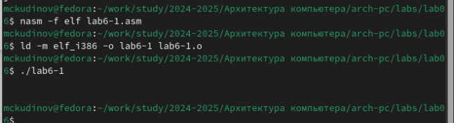

*Рис. 7: Запуск исполняемого файла* 

Создаю новый файл lab6-2.asm с помощью утилиты touch (рис. 8). 

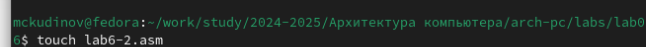

*Рис. 8: Создание файла* 

Ввожу в файл текст другойпрограммы для вывода значения регистра eax (рис. 9). 

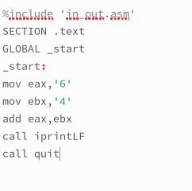

*Рис. 9: Редактирование файла* 

Создаю и запускаю исполняемый файл lab6-2 (рис. 10). Теперь вывод число 106, потому что программа позволяет вывести именно число, а не символ, хотя все еще происходит именно сложение кодов символов “6” и “4”. 

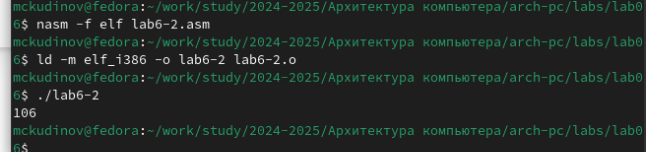

*Рис. 10: Запуск исполняемого файла* 

Заменяю в тексте программы в файле lab6-2.asm символы “6” и “4” на числа 6 и 4 (рис. 11). 

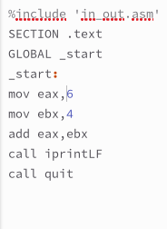

*Рис. 11: Редактирование файла* 

Создаю и запускаю новый исполняемый файл (рис. 12).. Теперь программа складывает не соответствующие символам коды в системе ASCII, а сами числа, поэтому вывод 10. 

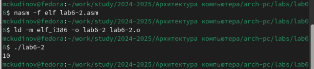

*Рис. 12: Запуск исполняемого файла* 

Заменяю в тексте программы функцию iprintLF на iprint (рис. 13). 

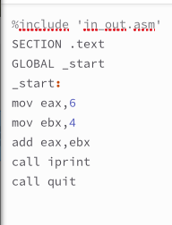

*Рис. 13: Редактирование файла* 

Создаю и запускаю новый исполняемый файл (рис. 14). Вывод не изменился, потому что символ переноса строки не отображался, когда программа исполнялась с функцией iprintLF, а iprint не добавляет к выводу символ переноса строки, в отличие от iprintLF. 

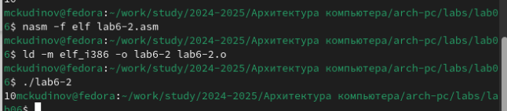

*Рис. 14: Запуск исполняемого файла* 

2. **Выполнение арифметических операций в NASM** 

Создаю файл lab6-3.asm с помощью утилиты touch (рис. 15). 

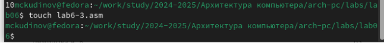

*Рис. 15: Создание файла* 

Ввожу в созданный файл текст программы для вычисления значения выражения f(x) = (5 \* 2 + 3)/3 (рис. 16). 

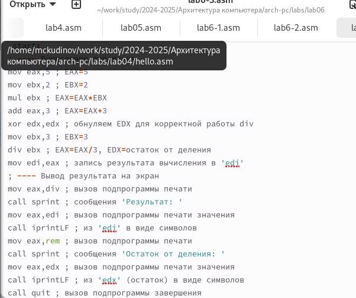

*Рис. 16: Редактирование файла* 

Создаю исполняемый файл и запускаю его (рис. 17). 

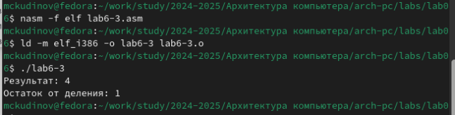

*Рис. 17: Запуск исполняемого файла* 

Изменяю программу так, чтобы она вычисляла значение выражения f(x) = (4 \* 6 + 2)/5 (рис. 18). 

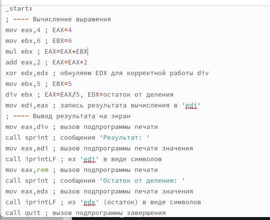

*Рис. 18: Изменение программы* 

Создаю и запускаю новый исполняемый файл (рис. 19). Я посчитала для проверки правильности работы программы значение выражения самостоятельно, программа отработала верно. 

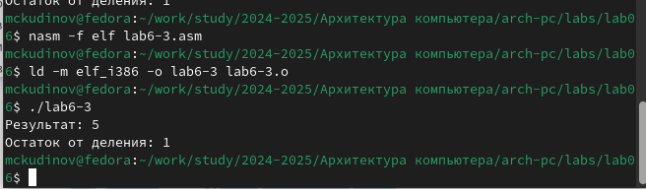

*Рис. 19: Запуск исполняемого файла* 

Создаю файл variant.asm с помощью утилиты touch (рис. 20). 

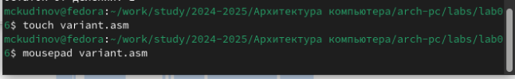

*Рис. 20: Создание файла* 

Ввожу в файл текст программы для вычисления варианта задания по номеру студенческого билета (рис. 21). 

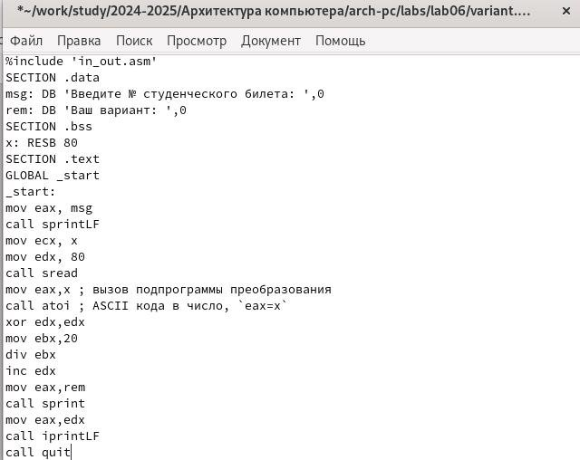

*Рис. 21: Редактирование файла* 

Создаю и запускаю исполняемый файл (рис. 22). Ввожу номер своего студ. билета с клавиатуры, программа вывела, что мой вариант - 8. 

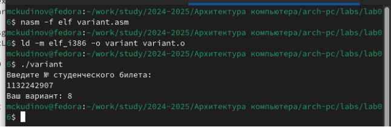

*Рис. 22: Запуск исполняемого файла* 

**4.2.1  Ответы на вопросы по программе** 

1. За вывод сообщения “Ваш вариант” отвечают строки кода: 

**mov** **eax**,rem **call** sprint

2. Инструкция mov ecx, x используется, чтобы положить адрес вводимой строки x в регистр ecx mov edx, 80 - запись в регистр edx длины вводимой строки call sread - вызов подпрограммы из внешнего файла, обеспечивающей ввод сообщения с клавиатуры 
2. call atoi используется для вызова подпрограммы из внешнего файла, которая преобразует ascii-код символа в целое число и записывает результат в регистр eax 
2. За вычисления варианта отвечают строки: 

**xor** **edx**,**edx** *; обнуление edx для корректной работы div* **mov** **ebx**,20 *; ebx = 20*

**div** **ebx** *; eax = eax/20, edx - остаток от деления*

**inc** **edx** *; edx = edx + 1*

5. При выполнении инструкции div ebx остаток от деления записывается в регистр edx 
5. Инструкция inc edx увеличивает значение регистра edx на 1 
5. За вывод на экран результатов вычислений отвечают строки: 

**mov** **eax**,**edx call** iprintLF 

3. **Выполнение заданий для самостоятельной работы** 

Создаю файл lab7-4.asm с помощью утилиты touch (рис. 23). 

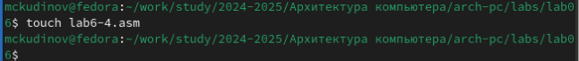

*Рис. 23: Создание файла* 

Открываю созданный файл для редактирования, ввожу в него текст программы для вычисления значения выражения (11 + x) \* 2 - 6 (рис. 24). Это выражение было под вариантом 8. 

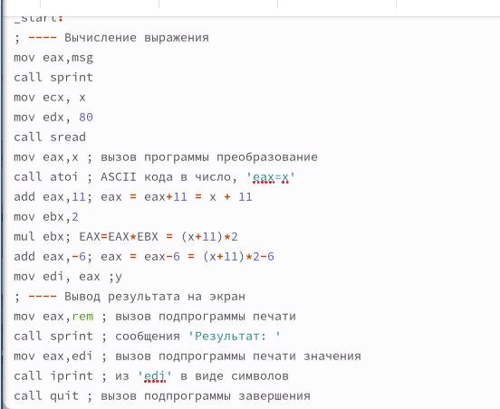

*Рис. 24: Написание программы* 

Создаю и запускаю исполняемый файл (рис. 25). При вводе значения 3, вывод - 22. 

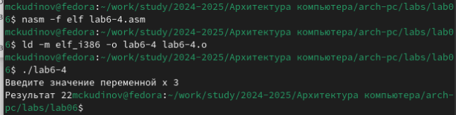

*Рис. 25: Запуск исполняемого файла* 

Провожу еще один запуск исполняемого файла для проверки работы программы с другим значением на входе (рис. 26). Программа отработала верно. 

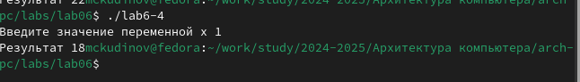

*Рис. 26: Запуск исполняемого файла* 

**Листинг 4.1. Программа для вычисления значения выражения (11 + x) \* 2 − 6.** 

%include 'in\_out.asm' ; подключение внешнего файлаты

**SECTION** .data *; секция инициированных данных*

msg: DB 'Введите значение переменной х: ',0

rem: DB 'Результат: ',0

**SECTION** .bss *; секция не инициированных данных*

x: RESB 80 *; Переменная, значение к-рой будем вводить с клавиатуры, выделенный р азмер - 80 байт*

**SECTION** .text *; Код программы*

**GLOBAL** \_start *; Начало программы*

\_start: *; Точка входа в программу*

- *---- Вычисление выражения*

**mov** **eax**, msg *; запись адреса выводимиого сообщения в eax*

**call** sprint *; вызов подпрограммы печати сообщения*

**mov** **ecx**, x *; запись адреса переменной в ecx*

**mov** **edx**, 80 *; запись длины вводимого значения в edx*

**call** sread *; вызов подпрограммы ввода сообщения*

**mov** **eax**,x *; вызов подпрограммы преобразования*

**call** atoi *; ASCII кода в число, `eax=x`*

**add** **eax**,11*; eax = eax+11 = x + 11*

**mov** **ebx**,2 *; запись значения 2 в регистр ebx*

**mul** **ebx***; EAX=EAX\*EBX = (x+11)\*2*

**add** **eax**,-6*; eax = eax-6 = (x+11)\*2-6*

**mov** **edi**,**eax** *; запись результата вычисления в 'edi'*

- *---- Вывод результата на экран*

**mov** **eax**,rem *; вызов подпрограммы печати*

**call** sprint *; сообщения 'Результат: '*

**mov** **eax**,**edi** *; вызов подпрограммы печати значения* **call** iprint *; из 'edi' в виде символов* **call** quit *; вызов подпрограммы завершения*

**5  Выводы** 

При выполнении данной лабораторной работы я освоил арифметические инструкции языка ассемблера NASM. 

**6  Список литературы** 

1. [Лабораторная работа №7 ](https://esystem.rudn.ru/pluginfile.php/1584637/mod_resource/content/1/%D0%9B%D0%B0%D0%B1%D0%BE%D1%80%D0%B0%D1%82%D0%BE%D1%80%D0%BD%D0%B0%D1%8F%20%D1%80%D0%B0%D0%B1%D0%BE%D1%82%D0%B0%20%E2%84%967.pdf)
1. [Таблица ASCII ](https://www.rapidtables.com/code/text/ascii-table.html)
